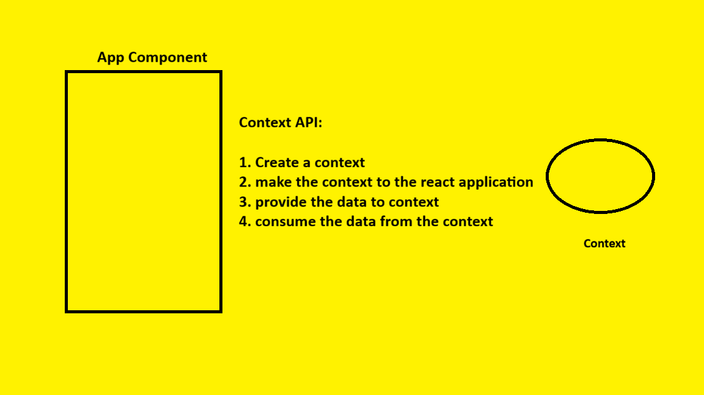

# Context API in React

## What is Context API?

**Context API** is used to share data between components **without passing props manually at every level**.

This problem is called:

## Prop Drilling

In Context API, we can pass data from **parent to child components**, but **not directly from child to parent**.

---

# Problem Without Context API

Suppose we have the following component hierarchy:

```text
App  ← Has Data
│
├── A
│
├── B
│    └── C
│         └── D
│              └── E
│
├── F
│
├── G
│
└── H
     └── I
```

Now suppose the `App` component wants to send data to component `E`.

To do that using props, we must pass data through:

```text
App → B → C → D → E
```

Even though components `B`, `C`, and `D` do not use the data, they still have to pass it forward.

This is called:

# Prop Drilling

This process becomes difficult and messy in large applications.

---

# Solution: Context API

To avoid prop drilling, React provides **Context API**.

With Context API:

* We create a **Context**
* Store data inside it
* Any child component can directly access the data

---

# Context API Flow

```text
App Component
      │
      ▼
 Context Provider
      │
 ┌────┴────┐
 ▼         ▼
A          B
           │
           ▼
           C
           │
           ▼
           D
           │
           ▼
           E  ← Directly Access Data
```

See the Image below:



---

# Steps to Implement Context API

## Step 1: Create Context

```jsx
const ctx = React.createContext();
```

Creates a context object.

---

## Step 2: Provide Context

```jsx
<ctx.Provider>
    Components
</ctx.Provider>
```

Makes the context available to child components.

---

## Step 3: Pass Data to Context

```jsx
<ctx.Provider value={data}>
    Components
</ctx.Provider>
```

Provides data to all child components.

---

## Step 4: Consume Context Data

```jsx
const ctxData = React.useContext(ctx);
```

Used to access data from the context.

---

# Important Points

## 1. Why do we use Context API?

To share data from parent to multiple child components without prop drilling.

Examples:

* Logged-in user data
* Theme (Dark/Light)
* Language settings
* Cart data

---

## 2. Can Context API pass data from child to parent?

❌ No

Context API is mainly used for:

* Parent → Child communication

---

## 3. Can we create multiple contexts?

✅ Yes

We can create multiple contexts in a React application.

Example:

* UserContext
* ThemeContext
* AuthContext

---

# Interview Definition

> Context API is a React feature used to share data globally between components without manually passing props at every level.
